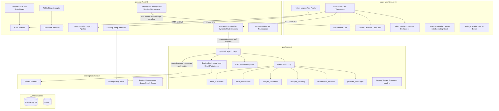

# Banking Agent CRM

AI-powered multi-tenant Banking CRM for relationship managers. It supports both:
- a **dynamic chat agent session flow** (primary) powered by LangGraph tool-calling, and
- a **legacy staged run pipeline** for historical run/replay workflows.

The platform fetches customers via natural-language, analyzes behavior, recommends products with rationale, and generates bilingual WhatsApp outreach.

## Architecture



## Monorepo Structure

```
banking-agent-crm/
├── apps/
│   ├── web/                    # Next.js 15 App Router
│   │   ├── src/app/
│   │   │   ├── dashboard/      # Session chat UI (left/center/right panels)
│   │   │   ├── history/[id]/   # Run replay with dark hero header
│   │   │   ├── customer/[id]/  # Customer profile + spending chart
│   │   │   └── settings/       # Scoring bracket editor
│   │   └── src/components/
│   │       ├── chat/           # Chat window, tool cards, session sidebar, right insight sidebar
│   │       ├── customers/      # CustomerCard, SpendingCategoryChart
│   │       ├── history/        # CompactCustomerRow, RunDetailView
│   │       ├── settings/       # BracketEditor, NlTunePanel
│   │       └── workflow/       # Legacy pipeline StepList with live progress bars
│   └── api/                    # NestJS
│       └── src/modules/
│           ├── auth/           # Login/logout/me — ADMIN PII override
│           ├── customer/       # Paginated list + spending categories
│           ├── crm/            # Legacy staged pipeline (run/history/replay)
│           ├── crm-session/    # Dynamic chat sessions + WebSocket events
│           ├── ai/             # Dynamic LangGraph agent service + legacy orchestrator
│           └── scoring-config/ # Tenant-scoped bracket CRUD
├── packages/
│   ├── config/       # Shared ESLint, TS, Prettier configs
│   ├── types/        # Shared TypeScript interfaces
│   ├── database/     # Prisma schema + client + seed (1000 customers)
│   ├── ai/           # LangGraph graph + scoring engine + RAG
│   └── ui/           # Shared React components (shadcn wrappers)
├── docker-compose.yml
└── turbo.json
```

## Quick Start

### Prerequisites

- Node.js 22+
- pnpm 9+
- Docker + Docker Compose
- OpenAI API key

### With Docker Compose

```bash
# Clone and navigate
git clone <repo> banking-agent-crm && cd banking-agent-crm

# Set your OpenAI key
echo "OPENAI_API_KEY=sk-..." > .env

# Start all services (postgres, redis, api, web, db-migrate+seed)
docker-compose up
```

- Web: http://localhost:3000
- API: http://localhost:3001

### Local Development

```bash
# Install dependencies
pnpm install

# Start PostgreSQL and Redis
docker-compose up postgres redis -d

# Copy and configure environment
cp apps/api/.env.example apps/api/.env
# Edit DATABASE_URL, SESSION_SECRET, OPENAI_API_KEY

# Generate Prisma client + migrate + seed
pnpm db:generate
pnpm db:migrate
pnpm db:seed

# Start all apps in parallel
pnpm dev
```

## Seed Credentials

After seeding, two tenants are created with admin users:

| Tenant Slug        | Email                        | Password     | Role  |
|--------------------|------------------------------|--------------|-------|
| `hdfc-bangalore`   | `admin@hdfc-bangalore.com`   | `Admin@1234` | ADMIN |
| `icici-mumbai`     | `admin@icici-mumbai.com`     | `Admin@1234` | ADMIN |

## Key Features

### Multi-Tenancy
Every entity is scoped by `tenantId`. The `X-Tenant-Slug` header resolves tenant context. `SessionGuard` prevents cross-tenant session reuse.

### PII Masking
`PiiMaskingInterceptor` recursively masks 8 PII fields per user's `piiVisibility` config. Admin users always receive unmasked data regardless of DB column value — the override is applied at login and session refresh in `auth.service.ts`.

- Phone: `XXXXXX3210`
- Email: `j***@***.***`
- PAN, Aadhaar, Address, DOB, Account Number

### AI Architecture (LangGraph)

```
Dynamic Session Agent (primary):
START → agent (LLM tool router) ↔ tools loop → END

Tools:
fetch_customers → fetch_transactions → analyze_customers
→ analyze_spending → explain_scores → recommend_products → generate_messages
```

- **Session memory**: fetched customers, scoring results, spending insights, and generated messages are persisted in graph state per session thread.
- **Schema-aware querying**: `fetch_customers` builds SQL from natural language using full DB schema context and retry/repair on SQL errors.
- **Real-time chat events**: WebSocket emits `tool:start`, `tool:done`, `tool:error`, and `message:complete` events.
- **Direct WhatsApp generation**: messages are generated immediately when requested (no mandatory approval gate).
- **Legacy flow retained**: the staged `crm` graph still powers historical run/replay paths.

### Scoring Engine

Brackets are configurable per-tenant via the Settings page and persisted in the `ScoringConfig` table. Defaults:

| Rule | Max Points |
|---|---|
| Monthly salary (SALARY CREDIT txns) | 25 |
| Average balance | 25 |
| Spending diversity + income ratio | 20 |
| Months with salary credit (12m) | 15 |
| Product headroom | 10 |
| Age band (28-40 optimal) | 10 |
| Recent activity (30d txns) | 5 |
| Personal loan penalty | −8 |
| Home loan penalty | −3 |
| Combined cap | −10 max |

**Qualify threshold**: score ≥ 75  
**Readiness**: Primed (≥88) · Engaged (≥75) · Dormant (≥55) · At-Risk (<55)

### Spending Category Analytics

The customer detail page shows a donut chart breaking down the last 12 months of debit transactions by category (Grocery, Shopping, Dining, Entertainment, Travel, Fuel, Utilities, Medical, EMI, Other). Powered by a `transaction.groupBy` query in `customer.repository.ts`, displayed via `SpendingCategoryChart` with a savings rate indicator.

### Session Chat Workspace (Dashboard)

`/dashboard` is now a session-first assistant workspace:
- **Left panel**: session list and archive actions
- **Center panel**: conversational assistant + tool result cards
- **Right panel**: fetched customer intelligence with per-customer:
  - allocated products
  - recommendation rationale + confidence
  - spending analytics (LLM-generated insights)
  - generated WhatsApp content
  - action buttons (generate/view WhatsApp, view analytics if available)

### History Run Replay (Legacy)

`/history/[id]` features a dark gradient hero header with run stats, and a filterable/sortable customer list using `CompactCustomerRow` — a collapsible row with an SVG score ring, product pills, persona badge, and expandable breakdown + WhatsApp message panel.

### Configurable Scoring Brackets

Admins can adjust scoring thresholds for each rule via the Settings page. Changes are persisted per-tenant in `ScoringConfig` and picked up on the next pipeline run without a redeploy.

## Scripts

```bash
pnpm dev              # Start all apps
pnpm build            # Build all apps
pnpm lint             # Lint all packages
pnpm typecheck        # Type-check all packages
pnpm test             # Run unit + integration tests
pnpm test:e2e         # Run Playwright E2E tests
pnpm db:generate      # Generate Prisma client
pnpm db:migrate       # Run Prisma migrations
pnpm db:seed          # Seed 1000 customers
```

## Tech Stack

| Layer | Technology |
|---|---|
| Frontend | Next.js 15, React 19, TailwindCSS, shadcn/ui, Recharts |
| Backend | NestJS, express-session, Socket.io |
| AI/ML | LangGraph, LangChain, OpenAI GPT-4o / GPT-4o-mini |
| Database | PostgreSQL 16, Prisma 5 |
| Cache / Rate Limit | Redis 7, @nestjs/throttler |
| Build | Turborepo, pnpm workspaces |
| Testing | Jest, Vitest, fast-check, Playwright |
| CI | Husky + lint-staged + commitlint |

## Video demo
https://kommodo.ai/recordings/FMy7db029eMZmmB8aGyX

## Server Logs SS


